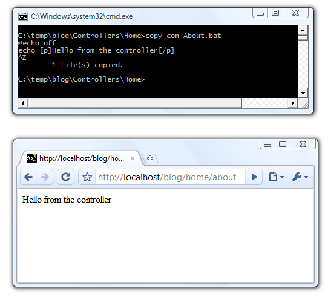

To get started open a {{cmd}} window.
If you're not familiar with a {{cmd}} window, you soon will be. ;-)

Make sure {{dope.bat}} file is in your {{path}}.
If you're not familiar with your {{path}}, you soon will be.  Wait a second. Read the 'Quick tip,' over there on the right. -->

>{ 
## QuickTip: Adding dope to your path
If {{dope.bat}} is in the folder {{C:\DoD}} then type this:
{{
PATH=%PATH%;c:\DoD;
}}
}>

Okay. Moving on. 
First step, navigate to a folder where you want to create your web application.
e.g.
{{
C:\>cd Temp
C:\Temp>
}}

Temp is a great place to do all your work. It implies the kind of permanence that a Dos On Dope project deserves. 

**To create a site called {{'Blog'}} we use the {{'dope'}} command. It's as simple as this:**

{{
  C:\Temp>dope site Blog
}}

Time for another side bar. Over there --> on the right.
>{ 
## QuickTip: Help from the Command Line
Issue the {{dope}} command (i.e. call {{dope.bat}}) 
without any parameters, to get help. 

For help with a particular command, try
dope help _commandname_,
e.g.
{{dope help site}}
}>

IIS is a little hard to control from the console, so you'll need to open IIS manager and register your site manually. Read the sidebar about how to do that.
_(If we were using apache, tomcat or webrick we'd be able to do this from the command-line with ease.  If I took this project more seriously, I would have written a custom DOS-based web-server. But then I guess I would've been an even more depraved individual, so for now we're stuck with IIS.)_

>{ 
## QuickTip: Registering Manually with IIS
Add a virtual directory under the {{Default Web Site}}
Then right click and 'convert to application'
Browse to the newly created application. 
}>

Let's check in a browser that our new site is built.

Oops. It worked. We're up and running.

It's generated the complete skeleton of the application. Here's what we see in the console:

Let's see what's been created for us. We now have these folders:

{{
C:\temp\blog>dir /s/a:d/b
C:\temp\blog\Content
C:\temp\blog\Controllers
C:\temp\blog\h
C:\temp\blog\Models
C:\temp\blog\Scripts
C:\temp\blog\Views
C:\temp\blog\Controllers\Home
C:\temp\blog\Views\Shared
}}

And these files:

{{
C:\temp\blog>dir /s/a:-d/b
C:\temp\blog\Default.aspx
C:\temp\blog\favicon.ico
C:\temp\blog\Global.asax
C:\temp\blog\web.config
C:\temp\blog\Content\Site.css
C:\temp\blog\Content\li.png
C:\temp\blog\Content\Logo.png
C:\temp\blog\Controllers\_actionMissing.bat
C:\temp\blog\Controllers\_controllerMissing.bat
C:\temp\blog\Controllers\Home\Index.bat
C:\temp\blog\h\a.bat
C:\temp\blog\h\h1.bat
C:\temp\blog\h\h2.bat
C:\temp\blog\h\h3.bat
C:\temp\blog\h\p.bat
C:\temp\blog\Models\split.vbs
C:\temp\blog\Views\Shared\_header.bat
}}

All the files you need for a modern MVC application. Built on batch files.

We have our site, and it shows the starting application. Let's create a new controller action, and see that it renders as expected..

In this case, our batch file is basically a series of echo statements that write html to the screen. Instead of angle brackets we use square brackets. (This is because DOS uses angle brackets for re-direction.)

We can do a little better than that. 

We can apply a theme by including a 'partial' view, called {{_header.bat.}}

And we can use helper methods to create clean markup.

Now, let's create a location for holding our data.

In DoD we embrace the NoSQL movement and jump straight to the data-store of the future: a CSV file.

{{
C:\temp>CD Blog\Models
C:\temp\Blog\Models>copy con Posts.csv
ID`Title`Article
^Z
}}

{{Posts.csv}} is both the model that describes our data, and the store which will contain the data itself.

(We use back-ticks rather than commas, so that there's no need to qualify our data with double-quotes.)

Now we can generate actions for administering our Posts. This is similar to the 'scaffolding' feature of Ruby On Rails.

{{
C:\temp\blog\Models>dope gen Post
Generating actions for MODEL Post in Controller Home...
}}

Now, if we look in the Home controller we see four batch files that have been created.

{{
C:\temp\blog\Controllers\Home>dir /b
add.bat
add.cmd
Index.bat
view.bat
}}

Notice there is an {{add.bat}} as well as an {{add.cmd}}. What's the difference? 
**In DosOnDope, {{GET}} verbs are handled by Batch files (.bat), while {{POST}} verbs are handled by {{.cmd}} files.**

Let's see what they look like. We browse to see the add action:

The generator has created a nice page for us, with a name and textbox for every field, so we can create new posts.

We enter some details...

...click submit and see what happens.

We're back at the index page. But now it's a list of all the articles. There's only one for now. 

Let's see what it looks like if we've added another article:

Behind the scenes when we pressed 'submit' the Http-Post was handled by {{'add.cmd'}} which unpacked the form variables and added the details to the file Posts.csv

{{
C:\temp\blog\Models>type Posts.csv
ID`Title`Article
1`Hello Brazil!`Yes, yes, hello indeed!
2`Let's add a second for good measure`Oh yeah
}}

That's about it. We've demonstrated all the components you need to make wonderful apps. 
Best of luck. I hope dope is good to you.